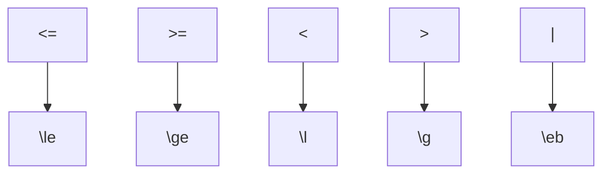

[Github Issues]: https://github.com/miguelrabuge/fedora/issues
[examples]: https://github.com/miguelrabuge/fedora/tree/main/fedora
[PyPI]: https://pypi.org/project/fedora-framework/

# Fedora Framework


Fedora Framework is an evolutionary feature engineering framework designed to streamline the process of creating and optimizing features for machine learning tasks. This project offers a flexible and extensible set of tools for feature engineering to help data scientists and machine learning engineers efficiently prepare their data for modeling.

## Features

- **Modular Design:** Fedora Framework is built around a modular architecture that allows you to easily extend and customize feature engineering components. You can mix and match different modules to suit your specific needs, using a Context-Free Grammar.

- **Automated Feature Generation:** Fedora Framework provides built-in tools for automatic feature generation, reducing the manual effort required to create features. You can define feature operators and let the framework generate features based on your specifications.

- **Feature Selection and Construction:** Identify and select the most important features for your models using various feature engineering techniques.

- **Support for Different Data Types:** Fedora Framework supports various data types, including numerical, categorical, text, and time-series data. You can easily specify how to handle different types of data.


## Installation

You can install Fedora Framework from [PyPI] using pip:

```bash
pip3 install fedora-framework
```

## Getting Started

After installing the Fedora framework, check our examples in classical machine learning datasets in the [examples] folder. Once inside this directory, to run the MNIST dataset example:

```bash
cd mnist
python3 main.py
```

## Contributing

We welcome contributions to Fedora Framework. Whether you want to add new features, fix bugs, improve documentation, or suggest enhancements, your contributions are valuable. 

Please reach out to us through the available [communication channels](#Contact).

## License

Fedora Framework is open-source and distributed under the MIT License. See [LICENSE](LICENSE) for details.

## Contact

If you have questions, suggestions, or need support, feel free to reach out to us:

- Github Issues: https://github.com/miguelrabuge/fedora/issues 

- Email: rabuge@dei.uc.pt / naml@dei.uc.pt

<!-- ## Acknowledgments

We'd like to thank the open-source community for their contributions and support in making Fedora Framework a versatile and powerful tool for feature engineering. -->

## Publications
🚧 Work in progress 🚧

## Citations
If you find this project useful or if you use any code, ideas, or resources from it, please consider citing the following sources:

```
Rabuge, M., & Lourenço, N. (2023). The Fedora Framework (Version 0.0.1) [Computer software]. https://doi.org/10.5281/zenodo.1234
```

```bibtex
@software{
    Rabuge_The_Fedora_Framework_2023,
    author = {Rabuge, Miguel and Lourenço, Nuno},
    doi = {10.5281/zenodo.1234},
    month = dec,
    title = {{The Fedora Framework}},
    url = {https://github.com/miguelrabuge/fedora},
    version = {0.0.1},
    year = {2023}
}
```

---
## Walktrough: Suiting the Framework to your own needs

In this chapter, we will explore how to customize the Fedora Framework to perfectly fit your data science and machine learning projects. Whether you are working on unique data types or advanced techniques, this chapter will guide you in maximizing the potential of the Fedora Framework for your specific needs.

We will use the [Car Evaluation Dataset](https://archive.ics.uci.edu/dataset/19/car+evaluation) in this walktrough.

### 1. Original dataset

First we will need to download the dataset. The UCI Machine Learning repository python package allow us to do such with ease. To install it, run:

```bash
pip3 install ucimlrepo
```
Create a _main.py_ file and load the data:

```PYTHON
from ucimlrepo import fetch_ucirepo 
dataset = fetch_ucirepo(id=19) 
```

Create a pandas Dataframe and load the data, with the first column being the targets:

```PYTHON
import pandas as pd
features = dataset.data.features
targets = dataset.data.targets
df = pd.concat([targets, features], axis=1)
```
At this point, the resulting dataset is the following:
```PYTHON
print(df)
```
```TEXT
      class buying  maint  doors persons lug_boot safety
0     unacc  vhigh  vhigh      2       2    small    low
1     unacc  vhigh  vhigh      2       2    small    med
2     unacc  vhigh  vhigh      2       2    small   high
3     unacc  vhigh  vhigh      2       2      med    low
4     unacc  vhigh  vhigh      2       2      med    med
...     ...    ...    ...    ...     ...      ...    ...
1723   good    low    low  5more    more      med    med
1724  vgood    low    low  5more    more      med   high
1725  unacc    low    low  5more    more      big    low
1726   good    low    low  5more    more      big    med
1727  vgood    low    low  5more    more      big   high

[1728 rows x 7 columns]
```

Regarding the metadata of the dataset:
```PYTHON
mt = dataset.metadata
print(f"Features: {mt.num_features}")
print(f"Types: {mt.feature_types}")
print(f"Entries: {mt.num_instances}")
print(f"Missing Values: {mt.has_missing_values}")

print(f"Summary:\n\n {mt.additional_info.summary}")
print(f"Info:\n\n {mt.additional_info.variable_info}")

print(df["class"].value_counts())
```

```TEXT
Features: 6
Types: ['Categorical']
Entries: 1728
Missing Values: no

Summary: 

Car Evaluation Database was derived from a simple hierarchical decision model originally developed for the demonstration of DEX, M. Bohanec, V. Rajkovic: Expert system for decision making. Sistemica 1(1), pp. 145-157, 1990.). The model evaluates cars according to the following concept structure:

CAR                      car acceptability
. PRICE                  overall price
. . buying               buying price
. . maint                price of the maintenance
. TECH                   technical characteristics
. . COMFORT              comfort
. . . doors              number of doors
. . . persons            capacity in terms of persons to carry
. . . lug_boot           the size of luggage boot
. . safety               estimated safety of the car

Input attributes are printed in lowercase. Besides the target concept (CAR), the model includes three intermediate concepts: PRICE, TECH, COMFORT. Every concept is in the original model related to its lower level descendants by a set of examples (for these examples sets see http://www-ai.ijs.si/BlazZupan/car.html).

The Car Evaluation Database contains examples with the structural information removed, i.e., directly relates CAR to the six input attributes: buying, maint, doors, persons, lug_boot, safety.

Because of known underlying concept structure, this database may be particularly useful for testing constructive induction and structure discovery methods.

Info:

buying:   vhigh, high, med, low.
maint:    vhigh, high, med, low.
doors:    2, 3, 4, 5more.
persons:  2, 4, more.
lug_boot: small, med, big.
safety:   low, med, high.

class
unacc    1210
acc       384
good       69
vgood      65
Name: count, dtype: int64
```

We can conclude that:
 - There are 4 highly unbalanced classes: "unacc", "acc", "good" and "vgood".
 - All 6 features are categorical. Therefore, they might require further preprocessing.
 - There are no missing values on the 1728 available entries. If there were, one should proceed to fix or delete such entries.

### Initial Representation and Operators

In this step, one must figure out how to represent the problem and which operators should use. 

An operator can be virtually anything that combines or simply tranforms features. Each specific data type might have specific operators.
- Examples: 
    - Integers and Floats: sum(a,b), subtraction(a,b), division(a,b), multiplication(a,b), absoluteValue(a,b), maximum(a,b), noise(a)
    - Boolean: AND(a,b), OR(a,b), NOT(a)
    - Strings: Concatenation(a,b), length(a) 

The following question is essencial: 

```Text
Am I able to think of operators that have the ability to combine the current features in a way that the resulting feature makes sense?
```
If the answer is yes, then jump into [next section](#defining-the-features).

If not, then we will have to think on how can we represent these features in a way that the result of an operator is interpretable:


**Related example**
Lets say that the entries *A*, *B* and *C*  have the following feature values:
```TEXT
Entry    buying    maint    ...
A        "vhigh"   "med"    ...
B        "high"    "med"    ...
C        "vhigh"   "low"    ...
```
If I select an operator "MyOpt" that counts the "i" in the strings, for the features "buying" and "maint", the transformed dataset is:

```TEXT
Entry    buying    maint    MyOpt(buying)  MyOpt(maint)    ...
A        "vhigh"   "med"    1              0             ...
B        "high"    "med"    1              0             ...
C        "vhigh"   "low"    1              0             ...
```

The resulting features are rather meaningless or at least not easily interpretable for the problem at hand.

However if I one-hot encode both features (will only display the buying-vhigh and maint-med codes for simplicity) and then use the logical AND operator:

```TEXT
Entry    buying-vhigh    ...    maint-med   ...    buying-vhigh AND maint-med    ...
A        True            ...    True        ...    True                        ...
B        False           ...    True        ...    False                       ...
C        True            ...    False       ...    False                       ...
```

The resulting feature (buying-vhigh AND maint-med) literally means:

```TEXT
Is the buying price of the car very high and the price of maintenance average (medium)?
```

As such, this feature and all features alike have the potential of being much more informative.

Hence, for the dataset at hand, we could one-hot encode all 6 features and then apply boolean operators (AND, OR, NOT). 

One-hot encoding the features, leaves us with the following dataset:
```PYTHON
# One-hot Encoding Features
df = pd.get_dummies(df, columns=df.columns[1:])

# Label encoding for numerical compatibility with ML models
df["class"] = df["class"].astype('category').cat.codes

print(df)
```

```TEXT
      class  buying_high  buying_low  buying_med  buying_vhigh  maint_high  maint_low  ...  persons_more  lug_boot_big  lug_boot_med  lug_boot_small  safety_high  safety_low  safety_med
0         2        False       False       False          True       False      False  ...         False         False         False            True        False        True       False
1         2        False       False       False          True       False      False  ...         False         False         False            True        False       False        True
2         2        False       False       False          True       False      False  ...         False         False         False            True         True       False       False
3         2        False       False       False          True       False      False  ...         False         False          True           False        False        True       False
4         2        False       False       False          True       False      False  ...         False         False          True           False        False       False        True
...     ...          ...         ...         ...           ...         ...        ...  ...           ...           ...           ...             ...          ...         ...         ...
1723      1        False        True       False         False       False       True  ...          True         False          True           False        False       False        True
1724      3        False        True       False         False       False       True  ...          True         False          True           False         True       False       False
1725      2        False        True       False         False       False       True  ...          True          True         False           False        False        True       False
1726      1        False        True       False         False       False       True  ...          True          True         False           False        False       False        True
1727      3        False        True       False         False       False       True  ...          True          True         False           False         True       False       False

[1728 rows x 22 columns]
```
We were left with an encoded label and 21 boolean features. 

### Defining the features 

Having selected the operators (logical AND, OR and NOT) and the original dataset prepared, we are left to define the contruction rules of the new features. This can be achieved through a Context-Free Grammar (CFG) that will serve as input for the framework. 

First, you should select how many features should the transformed dataset have, at maximum. In order not to bias this process, we can define this number equal to the number of features that are in the prepared dataset, i.e. 21. Then, to generate the grammar, run:

```PYTHON
from fedora.utilities.lib import generate_grammar

parameters = {
      "max_features": 21,
      "operators1": ["~"],                  # Arity = 1: NOT (~)
      "operators2": ["&", "\eb"],           # Arity = 2: AND (&), OR (| -> \eb)
      "columns": df.columns[1:]
}

with open("car-evaluation.bnf", "w") as f:
      grammar = generate_grammar(**parameters)
      print(grammar, file=f)
```

This simple function is only here to bootstrap your grammar, you are welcome to manually tweak it. The grammar is displayed below, in Backus-Naur Form (BNF):

```BNF
# car-evaluation.pybnf
<start> ::= <feature>,|<feature>,<feature>|<feature>,<feature>,<feature>|<feature>,<feature>,<feature>,<feature>|<feature>,<feature>,<feature>,<feature>,<feature>|<feature>,<feature>,<feature>,<feature>,<feature>,<feature>|<feature>,<feature>,<feature>,<feature>,<feature>,<feature>,<feature>|<feature>,<feature>,<feature>,<feature>,<feature>,<feature>,<feature>,<feature>|<feature>,<feature>,<feature>,<feature>,<feature>,<feature>,<feature>,<feature>,<feature>|<feature>,<feature>,<feature>,<feature>,<feature>,<feature>,<feature>,<feature>,<feature>,<feature>|<feature>,<feature>,<feature>,<feature>,<feature>,<feature>,<feature>,<feature>,<feature>,<feature>,<feature>|<feature>,<feature>,<feature>,<feature>,<feature>,<feature>,<feature>,<feature>,<feature>,<feature>,<feature>,<feature>|<feature>,<feature>,<feature>,<feature>,<feature>,<feature>,<feature>,<feature>,<feature>,<feature>,<feature>,<feature>,<feature>|<feature>,<feature>,<feature>,<feature>,<feature>,<feature>,<feature>,<feature>,<feature>,<feature>,<feature>,<feature>,<feature>,<feature>|<feature>,<feature>,<feature>,<feature>,<feature>,<feature>,<feature>,<feature>,<feature>,<feature>,<feature>,<feature>,<feature>,<feature>,<feature>|<feature>,<feature>,<feature>,<feature>,<feature>,<feature>,<feature>,<feature>,<feature>,<feature>,<feature>,<feature>,<feature>,<feature>,<feature>,<feature>|<feature>,<feature>,<feature>,<feature>,<feature>,<feature>,<feature>,<feature>,<feature>,<feature>,<feature>,<feature>,<feature>,<feature>,<feature>,<feature>,<feature>|<feature>,<feature>,<feature>,<feature>,<feature>,<feature>,<feature>,<feature>,<feature>,<feature>,<feature>,<feature>,<feature>,<feature>,<feature>,<feature>,<feature>,<feature>|<feature>,<feature>,<feature>,<feature>,<feature>,<feature>,<feature>,<feature>,<feature>,<feature>,<feature>,<feature>,<feature>,<feature>,<feature>,<feature>,<feature>,<feature>,<feature>|<feature>,<feature>,<feature>,<feature>,<feature>,<feature>,<feature>,<feature>,<feature>,<feature>,<feature>,<feature>,<feature>,<feature>,<feature>,<feature>,<feature>,<feature>,<feature>,<feature>|<feature>,<feature>,<feature>,<feature>,<feature>,<feature>,<feature>,<feature>,<feature>,<feature>,<feature>,<feature>,<feature>,<feature>,<feature>,<feature>,<feature>,<feature>,<feature>,<feature>,<feature>
<feature> ::= <feature><op2><feature> | (<feature><op2><feature>) | x[<var>] | <op1>x[<var>]
<op1> ::= ~
<op2> ::= &|\eb
<var> ::= 'buying_high'|'buying_low'|'buying_med'|'buying_vhigh'|'maint_high'|'maint_low'|'maint_med'|'maint_vhigh'|'doors_2'|'doors_3'|'doors_4'|'doors_5more'|'persons_2'|'persons_4'|'persons_more'|'lug_boot_big'|'lug_boot_med'|'lug_boot_small'|'safety_high'|'safety_low'|'safety_med'
```

**Note:**
The grammar has some reserved symbols. If you would like to use them, please add their aliases to the grammar instead:



<br>

We also provide support for [ephemeral constants](https://deap.readthedocs.io/en/master/api/gp.html#:~:text=An%20ephemeral%20constant%20is%20a,arguments%20returning%20a%20random%20value.). 
E.g. Assuming that there are 2 types of numerical data (**float** and **int**), random noise could be added like this:
```BNF
...
<flt> ::= <flt><op><flt> | x[<fvar>] | x[<fvar>] + <fnoise>
<int> ::= <int><op><int> | x[<ivar>] | x[<ivar>] + <inoise>
<op> ::= +|-
<fnoise> ::= RANDFLOAT(0, 10) 
<inoise> ::= RANDINT(0, 10) 
...
``` 
Where the **fnoise** and **inoise** values are ephemeral constants.

### Tunning the Evolution Process

The Fedora Framework uses [Structured Grammatical Evolution (SGE)]() as the evolutionary algorithm. The Figure below shows the topology of the framework:


As any evolutionary algorithm, SGE requires certain parameters, such as population size, generations, etc. This is to be defined in a Yaml file as such:

```YAML
# car-evaluation.yml
POPSIZE: 50                                     # Population Size
GENERATIONS: 30                                 # Generations
ELITISM: 5                                      # Elistism (10%)
PROB_CROSSOVER: 0.9                             # Crossover: Probability
PROB_MUTATION: 0.1                              # Mutation: Probability
TSIZE: 3                                        # Selection: Tournament Size
EXPERIMENT_NAME: 'car-evaluation-results/'      # Results folder name
INCLUDE_GENOTYPE: False                         # Option include the genotype in the logs
SAVE_STEP: 1                                    # Logging Frequency (every N generations)
VERBOSE: True                                   # Statistics of each generation when running the algorithm 
MIN_TREE_DEPTH: 3                               # Genetic Programming Tree Minimum Depth
MAX_TREE_DEPTH: 10                              # Genetic Programming Tree Maximum Depth
```

**Note:** There are more parameters available for SGE (grammar, seed, run) that we will define indirectly, for simplicity. The above parameters are the only ones that one must include in the Yaml file.

### Running the Framework

At last, we will only have to define an error metric for the fitness of SGE, which is a minimization algorithm, and the Machine Learning model to assess the fitness.

At last, all that will be needed to evaluate the fitness of SGE is a machine learning model, an error measure, since SGE seeks to minimize the objective function, and the seeds for each run we would like to perform:

```python
from fedora.core.engine import Fedora
from fedora.core.utilities.metric import ErrorMetric

from sklearn.tree import DecisionTreeClassifier

configs = {
    "data": df,
    "seeds": [123, 321],
    "model": DecisionTreeClassifier(),
    "error_metric": ErrorMetric.balanced_error,

    "sge_parameters_path": "car-evaluation.yml",
    "grammar_path": "car-evaluation.pybnf",
    "logging_dir": "./"
}
fedora = Fedora(**configs).run()
```

Here we chose:
- A Decision Tree Classifier as the machine learning model, due to its interpretability
- To run the algorithm twice, with seeds 123 and 321, respectively
- Balanced Accuracy as the performance metric (The balanced error is just **1 - BAcc**), since the classes are unbalanced.

From this point, the algorithm will randomly split the dataset into 3: Training (40%), Validation (40%) and Test (20%), and use the first 2 subsets in the feature engineering process. Once ended, the results are logged and we are able to compare the best individuals, i.e. the best generated datasets, with the baseline (applying the DecisionTreeClassifier directly to the input dataframe).

### Logging and Results
Regarding logging, this instance of the framework will generated the following folder structure:

```
car-evaluation-results        # Results folder name
├── run_0_123                 # run_{run}_{seed} 
│   └── ...                   
└── run_1_321
    ├── best.json             # Best phenotype in this run
    ├── iteration1.json       # Log of the 1st generation
    ├── iteration2.json       # Log of the 2st generation
    ├── ...                   # ...
    ├── iteration30.json      # Log of the 30th generation
    ├── parameters.json       # Structured Grammatical Evolution Parameters
    ├── progress_report.csv   # Statistics of each generation 
    └── warnings.txt          # Logged runtime warnings 
```

Therefore, we can transform the original dataset with:
```PYTHON

```
#TODO
cite

