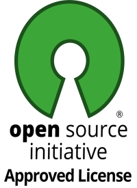

 

### The MIT-License

**Copyright © Massachusetts Institute of Technology (MIT)**

Everyone is permitted to copy and distribute verbatim copies of
this license document. 
Changing it is not allowed. 
This page mirrors the text from
<https://mit-license.org/>.
 
 

### **Begin license text.**

Copyright \<YEAR\> \<COPYRIGHT HOLDER\>

Permission is hereby granted, free of charge, to any person obtaining a copy of this software and associated documentation files (the "Software"), to deal in the Software without restriction, including without limitation the rights to use, copy, modify, merge, publish, distribute, sublicense, and/or sell copies of the Software, and to permit persons to whom the Software is furnished to do so, subject to the following conditions:

The above copyright notice and this permission notice shall be included in all copies or substantial portions of the Software.

**The software is provided "AS-IS", without warranty of any kind, expressed or implied, including but not limited to the warranties of merchantability, fitness for a particular purpose and non-infringement. In no event shall the authors or copyright holders be liable for any claim, damages or ohther liability, whether in an action of contract, tort or otherwise, arising from, out of or in connection with the software or the use or other dealings in the software.**

### **End license text.**

